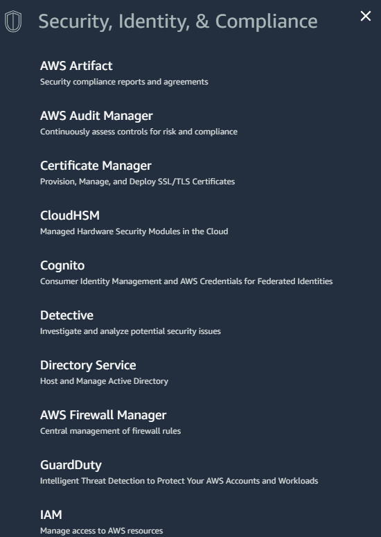
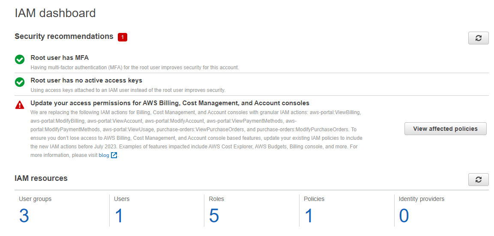
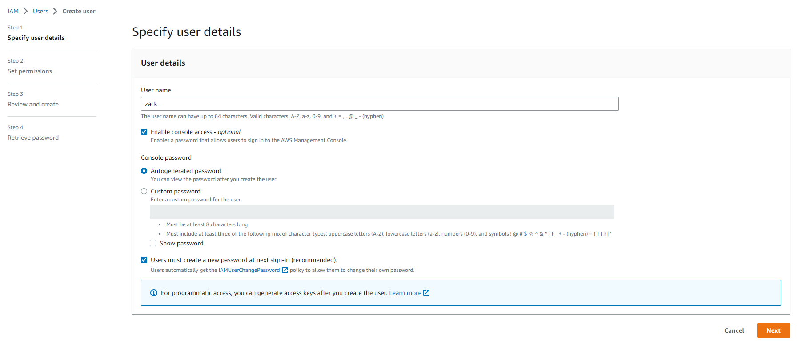
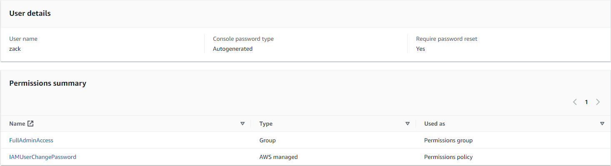
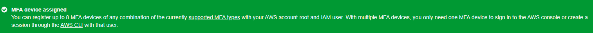

# Week 0 — Billing and Architecture

Course Video:  [Free AWS Cloud Project Bootcamp - Week 0 - Billing and Architecture](https://www.youtube.com/watch?v=SG8blanhAOg&list=PLBfufR7vyJJ7k25byhRXJldB5AiwgNnWv&index=11&ab_channel=ExamPro)

After Course Content: [Week 0 - Generate Credentials, AWS CLI, Budget and Billing Alarm via CLI](https://www.youtube.com/watch?v=OdUnNuKylHg&list=PLBfufR7vyJJ7k25byhRXJldB5AiwgNnWv&index=11&ab_channel=ExamPro)

## Homework Hard Assignments

### Setting up a Billing alarm


### Set a AWS Budget
#### Setting up the Zero Spend Budget


### Generating AWS Credentials

### Using CloudShell

### Conceptual Architecture Diagram or your Napkins


## Homework Stretch Assignments

### Create an admin user with MFA using IAM roles
Once I've logged in. I can go to the Services section and the subsection called "Security, Identity & Compliance".



You can click on the IAM section to get to the Identity and Access Management section. This is where you can create users, groups, and roles. You can also set up MFA and password policies.



Once we are in the IAM section, we can click on the "Users" section on the left hand side.

We can then click on the "Add user" button. This will bring up a new screen where we can create a new user.
Since we will want to access the management centre, we enable console access.



Now we need to set the user up with permissions. Since we want full Admin access, we will want to make a new IAM User Group with these permissions.

So create a new User Group and select the "AdministratorAccess" policy. This will give the user full admin access to the AWS Management Console.
The Policy document for this is:
```json
{
    "Version": "2012-10-17",
    "Statement": [
        {
            "Effect": "Allow",
            "Action": "*",
            "Resource": "*"
        }
    ]
}
```

Now that we have the User Group created with the AdministratorAccess policy, we can add the user to the group.



Now that we have the user created, we can sign in to the newly created user to set up MFA and Access keys.

Once, we have signed in we go straight to the IAM dashboard. From here, we can navigate to the "My Security Credentials" section.
This will allow us to set up MFA.

Once we have set up the MFA, we are all ready to go!




- Use EventBridge to hookup Health Dashboard to SNS and send notification when there is a service health issue.
- Review all the questions of each pillars in the Well Architected Tool (No specialized lens)
- Create an architectural diagram (to the best of your ability) the CI/CD logical pipeline in Lucid Charts
- Research the technical and service limits of specific services and how they could impact the technical path for technical flexibility.
- Open a support ticket and request a service limit
